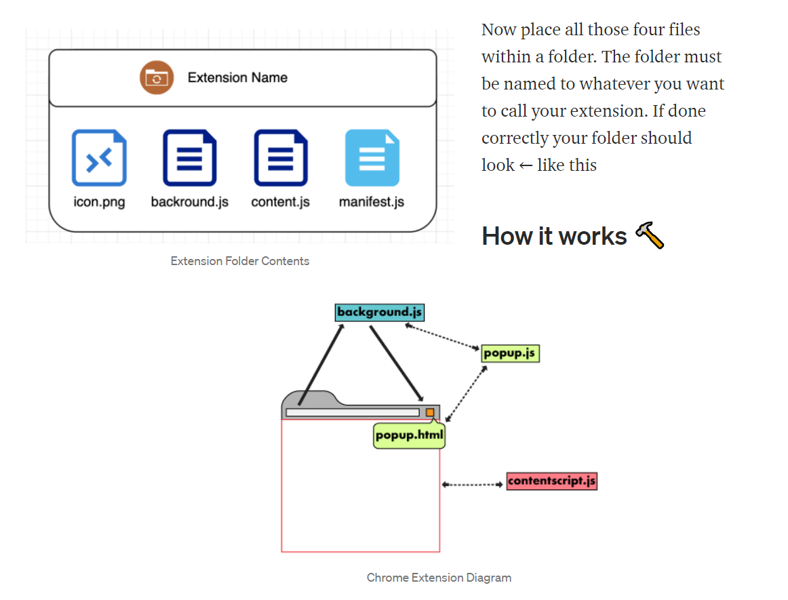

What are extensions? ⚙️
Extensions are small software programs that customize the browsing experience. They enable users to tailor Chrome functionality and behavior to individual preferences. They are built on web technologies such as HTML, JS, and CSS.

An extension must fulfil a single purpose that is narrowly defined and easy to understand. A single extension can include multiple components and a range of functionality, as long as everything contributes towards a common purpose.

Here are some example extensions, that are not currently present on Chrome and are not downloadable within the Extension Store, but can be added with a little bit of tinkering:

Usually, Chrome users just download their commonly needed extensions from the Extension Store, but some extensions are outdated and none functional.

How to create an extension? 🛠
We will start by creating a folder with these files:

1) manifest.json
The manifest.json file tells Chrome important information about your extension, like its name and which permissions it needs.

{
  "manifest_version": 2,
"name": "Chrome Plugin",
"description": "Testing Plugin",
"version": "1.0",
"content_scripts":[
    {
      "matches":[
        "http://oracle.com/*",
      ],
      "js": ["content.js"]
    }
  ],
"browser_action": {
    "default_icon": "icon.png",
    "default_popup": "popup.html"
  },
"background": {
      "scripts": ["background.js"],
      "persistent": false
    },
"permissions": [
    "activeTab",
    "storage",
    "https://ajax.googleapis.com/"
  ]
}

Now within the manifest file, all variables can be changed and most of them are self-explanatory. The matches variable will run the select content.js when a certain webpage has been opened, for example:

(1) -- Only run script if the webpage is http://oracle.com/
"matches":[
        "http://oracle.com/",
      ],
(2) -- Only run script if the webpage is http://oracle.com/ and any other pages linked to it. So the * means all
"matches":[
        "http://oracle.com/*",
      ],
(3) -- Run the script on all webpages
"matches":[
        "<all_urls>",
      ],

Or follow this little cheat sheet:
"<all_urls>": matches any URL that starts with a permitted scheme (http:, https:, file:, ftp:, or chrome-extension:).
"http://*/*": Matches any URL that uses the http: scheme.
"https://*/*": Matches any URL that uses the https: scheme.
"*://*/*": Matches any URL that uses the https: or http: scheme.

2) content.js
A content.js script is “a JavaScript file that runs in the context of web pages.” This means that a content script can interact with web pages that the browser visits.

// content.js
alert("Hello!")

3) Image Icon
Download an icon png file and place it within the created folder, you can download one here LINK .

4) background.js
Although the extension has been installed, it has no instruction. Introduce a background script by creating a file titled background.jsand placing it inside the extension directory.

// backround.js
alert("Backround S running")

Background scripts and many other components must be registered in the manifest. Registering a background script in the manifest tells the extension which files to reference, and how that file will behave.

Now place all those four files within a folder. The folder must be named to whatever you want to call your extension. If done correctly your folder should look ← like this

[][cws]

To import extensions into your browser:
Go to chrome://extensions in the target Chrome browser and enable "Developer mode" by the checkbox in the upper right.
Press “Load unpacked extension…” and choose the version-number folder inside the desired extension folder